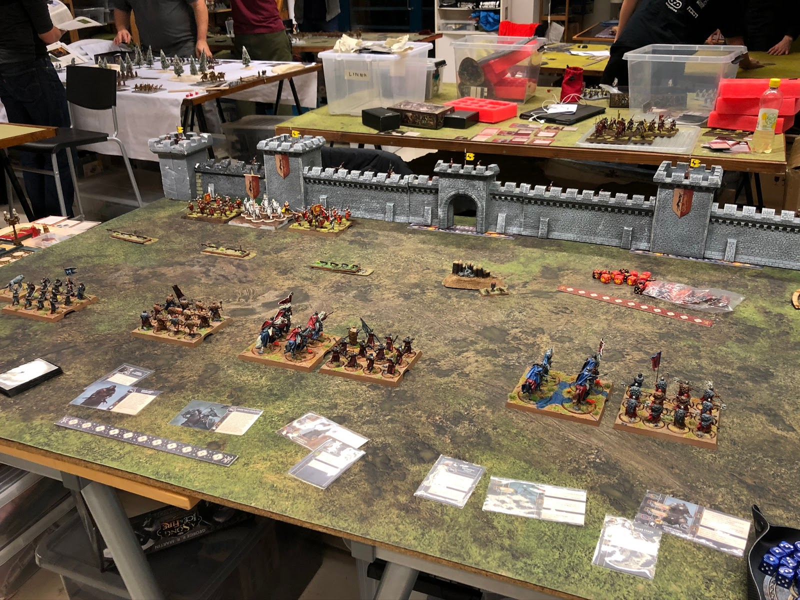
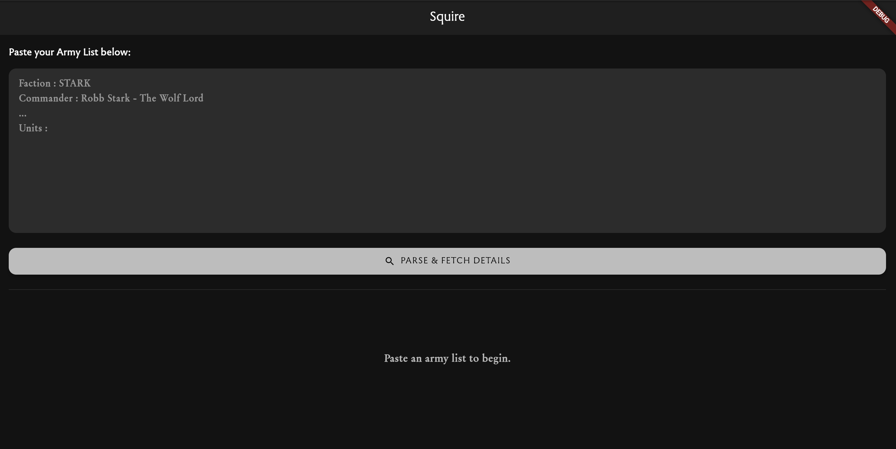
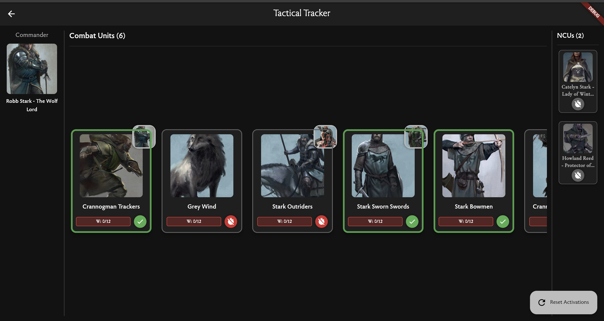
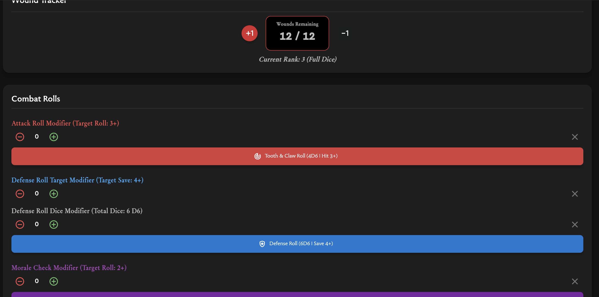

# **Individual Project Presentation**

---

## **Slide 1: Title**
# **Individual Project Presentation**

---

## **Slide 2: Background**
- Big tabletop fan  
- Play Wargames  

---

## **Slide 3: ASOIAF: The Miniatures Game**

- Typical war-game mechanics  
- A multitude of game mechanics to keep track of  

---

## **Slide 4: The Problem**

- Multitude of game mechanics  
- NCUs  
- Activations of units  
- Rolls for attack, defense, and morale  
- Attachments add special rules + orders for the unit  

---

## **Slide 5: Squire**

- Idea came from a comment a friend made  
- Will be able to keep track of units  

---

## **Slide 6: How It Works**

- Paste an army list into the input box  
- Gathers all data from MongoDB server  

---

## **Slide 7: What Went Wrong**
- Time management: balancing group project, course projects, and planning for next semester  
- Difficulty deciding how to lay out the project  
- Querying appropriate data and relearning MongoDB  

### **What Went Well**
- Found a dedicated GitHub repository for necessary data  

---

## **Slide 8: Sprint Results**

### **Sprint 1**
- Lines of code: **400**  
- Individual features completed: **2/6**  
- Individual requirements completed: **2/3**  
- Individual burndown rate: **35%**

### **Sprint 2**
-Number of features planned: **4**
-Number of requirements planned: **1**
---

## **Slide 9: What’s Next**
- Implement basic rule descriptions for NCUs  
- Show attachment order icons for units  
-Implement other special abilites for unti's attachments.
- Improve UI  

---

## **Slide 10: Timeline**
- **Projected Finish Date:** 11/28  
- Implement attachment data and improve UI  

---
